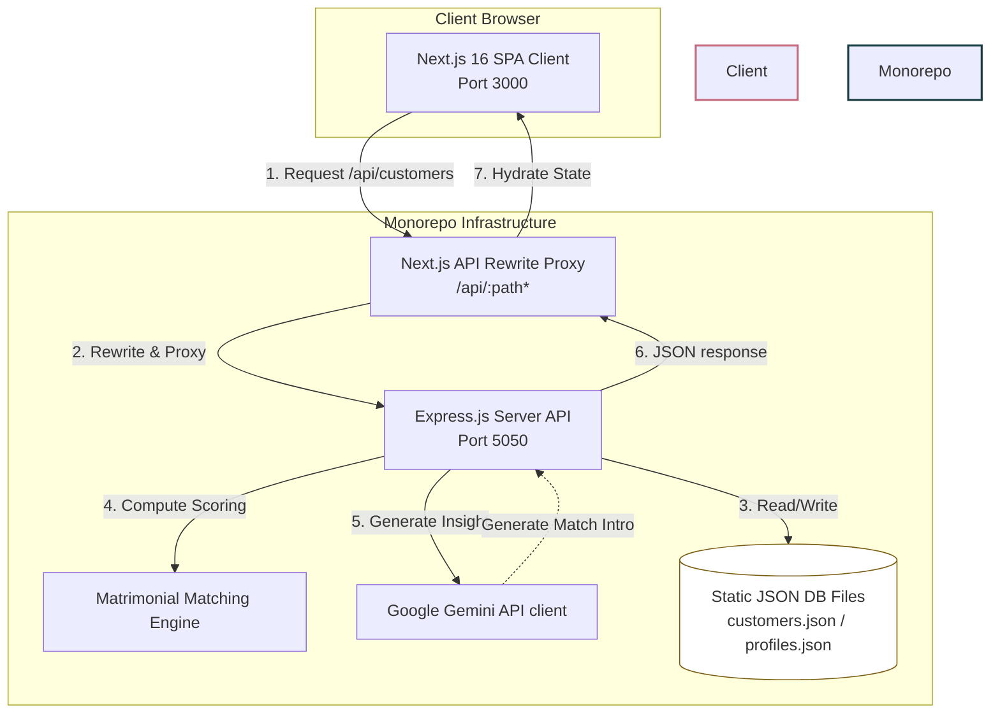
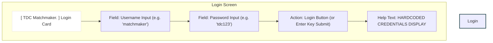
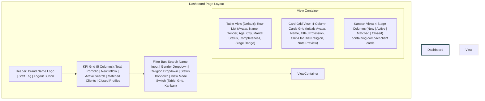

# TDC Matchmaker CRM Monorepo

An elegant, internal matchmaking workspace and portfolio manager designed for **The Dating Club (TDC)** matchmakers. The system is architected as a decoupled monorepo composed of a Next.js 16 frontend, an Express.js backend, a static JSON database, and documentation.

---

## 🚀 Quick Start & Installation

### 1. Install Dependencies
Clone the repository, navigate to the project root, and install dependencies for all workspace projects:
```bash
npm install
npm run install:all
```

### 2. Configure Gemini API Key
This application uses the Google Gemini API to generate personalized matchmaking summaries. To configure the API key, create a `.env.local` file in the root directory:
```env
GEMINI_API_KEY="your-google-gemini-api-key"
```
*Note: If no API key is provided (or if set to `your_key_here`), the backend seamlessly falls back to a **smart local heuristic generator** that outputs realistic, multi-sentence partner compatibility narratives based on matching vectors.*

### 3. Run the Development Environment
Run both backend and frontend servers concurrently:
```bash
# Start backend on port 5050 and frontend on port 3000
npm run dev:backend
# In a separate shell terminal session
npm run dev:frontend
```
Open [http://localhost:3000](http://localhost:3000) to view the client dashboard.

---

## 🔑 Login Credentials

Access the internal dashboard using the following credentials:
* **Username:** `matchmaker`
* **Password:** `tdc123`

---

## 📂 Project Structure

```text
Matchmaker Dashboard/
├── frontend/                 # Next.js 16 Client SPA (Port 3000)
│   ├── app/                  # Client-side user pages & routing
│   │   ├── dashboard/        # Main portfolio board (table, card grid, kanban)
│   │   ├── customers/[id]/   # Client details accordion & matches workspace
│   │   ├── login/            # Authentication view
│   │   └── matches/          # Match manager overview
│   ├── components/           # Reusable UI widgets & cards
│   ├── hooks/                # Custom hooks (useCustomers, useMatches, useNotes)
│   ├── styles/               # Styling system (globals.css custom tokens)
│   └── next.config.mjs       # Rewrites API routing proxy to backend (Port 5050)
│
├── backend/                  # Node.js Express.js API server (Port 5050)
│   ├── config/               # DB file path configs
│   ├── controllers/          # Endpoint controllers (auth, customers, matches, notes)
│   ├── lib/                  
│   │   ├── matching/         # Core compatibility matching algorithm
│   │   └── ai/               # Gemini API integration wrapper
│   ├── routes/               # API Router endpoints mapping
│   ├── services/             # Low-level JSON database reads/writes
│   └── server.js             # Express app bootloader & middlewares
│
├── database/                 # Structured schemas & data seed files
│   ├── schemas/              # Mongoose documentation schemas
│   └── seed/                 # Primary JSON datastores (customers.json, profiles.json)
│
├── docs/                     # Technical specs & engineering manuals
│   ├── architecture.md
│   └── matching-engine.md
└── package.json              # Monorepo task scripts runner
```

---

## 📐 System Architecture

The monorepo separates view representation from business computations and algorithms:



---

## 🎨 User Interface Wireframes

### 1. Login Page Layout


### 2. Portfolio Dashboard Page Layout


### 3. Customer Detail Page & Matchmaking Workspace
```mermaid
graph TD
    subgraph Customer Workspace
        TopBar["Top Navigation: ← Back to Portfolio List | Client Name | Back to Dashboard Button"]
        
        subgraph Sidebar (Left Column - 1/3 Width)
            Avatar["Avatar & Basic Specs (Name, Age, City, Stage Status Badge)"]
            Accordion1["CRM Controls Accordion (Search Paused Switch | Account Closed Switch)"]
            Accordion2["Customer Biodata Accordion (Personal, Career details, Religion, Lifestyle properties)"]
            NotesBox["Matchmaker notes text-area: Add meeting inputs & history timeline"]
        end
        
        subgraph Suggested Matches (Right Column - 2/3 Width)
            MatchHeader["Suggested Matches Panel Header: Opp Gender Pool Info | 'Top 5 Matches' tag"]
            Proposals["Active Proposals Panel: Collapsible list of sent match history statuses"]
            
            subgraph Suggested Match Card Stack
                EmptyState["Empty State: SVG Heart Illustration + 'Find Matches' CTA button (shown if matches not generated)"]
                Card1["Match Card: Gender Initials, Name, Profession, Location, Match Score Badge, Compatibility narrative intro"]
                Card2["Expanded Breakdown Accordion: Row Breakdown details for Caste, Tongue, Career, Location, Diet, etc"]
                CardActions["Card Action: 'Send Profile to Client' btn -> Opens Email Preview Overlay Modal"]
            end
        end
        
        TopBar --> Sidebar
        TopBar --> SuggestedMatches
    end
    style Customer Workspace fill:#fdfbf7,stroke:#163b40,stroke-width:2px
    style Sidebar fill:#fff,stroke:#e8e2da
    style Suggested Matches fill:#f3ece3,stroke:#e8e2da
```

---

## 📝 Architectural & Matching Engine Write-up

### 1. Decoupled Monorepo Design
To optimize developer productivity, the codebase splits frontend and backend concerns.
* **Next.js 15 Client Frontend:** Pure user-interface rendering layer. It utilizes Client Side Rendering (CSR) and React hooks to fetch state asynchronously. Hydration mismatches are eliminated by verifying mounting states.
* **Express.js API Backend:** Houses database query logic, algorithmic calculations, and external AI integrations. This setup guarantees that heavy computation and API keys remain hidden on the server, enhancing application security.
* **Static Database Storage:** Utilizes flat JSON files inside `database/seed/` ([customers.json](file:///Users/anjaliprajapati/Desktop/Matchmaker%20Dashboard/database/seed/customers.json) and [profiles.json](file:///Users/anjaliprajapati/Desktop/Matchmaker%20Dashboard/database/seed/profiles.json)) acting as static tables. File writes persist edits (such as status updates or staff meeting notes) across application cycles.

### 2. Matching Formula Engine
The compatibility score calculations reside in [matchmaker.js](file:///Users/anjaliprajapati/Desktop/Matchmaker%20Dashboard/backend/lib/matching/matchmaker.js) and rank candidates based on 9 core Indian matrimonial compatibility vectors:
1. **Religion/Caste (caste):** Matches religion. Shared castes yield maximum points. Different religions yield inter-faith adjustments.
2. **Mother Tongue (motherTongue):** Shared primary language compatibility.
3. **Location (location):** Proximity alignment. If from different cities, relocatability flags are evaluated to award scores.
4. **Family Values (familyValues):** Maps traditional/moderate/liberal spectrum values compatibility.
5. **Career/Income (salary):** Compares candidate packages relative to client income preferences.
6. **Diet (dietaryPreference):** Compares eating structures (Jain, Veg, Eggetarian, Non-Veg) in compatibility tiers.
7. **Education (education):** Degree/intellectual levels matching.
8. **Horoscope (horoscope):** Incorporates manglik and matching preferences.
9. **Age (age):** Calculates age difference tolerances.

### 3. Gemini Match Insights
When match calculations complete, the [openai.js](file:///Users/anjaliprajapati/Desktop/Matchmaker%20Dashboard/backend/lib/ai/openai.js) controller communicates with the Google Gemini API (`gemini-1.5-flash` model). It inputs normalized compatibility percentages and preferences to write structured 2-sentence third-person summaries directly targeted at the matchmaker (detailing positive alignments and key friction points).
