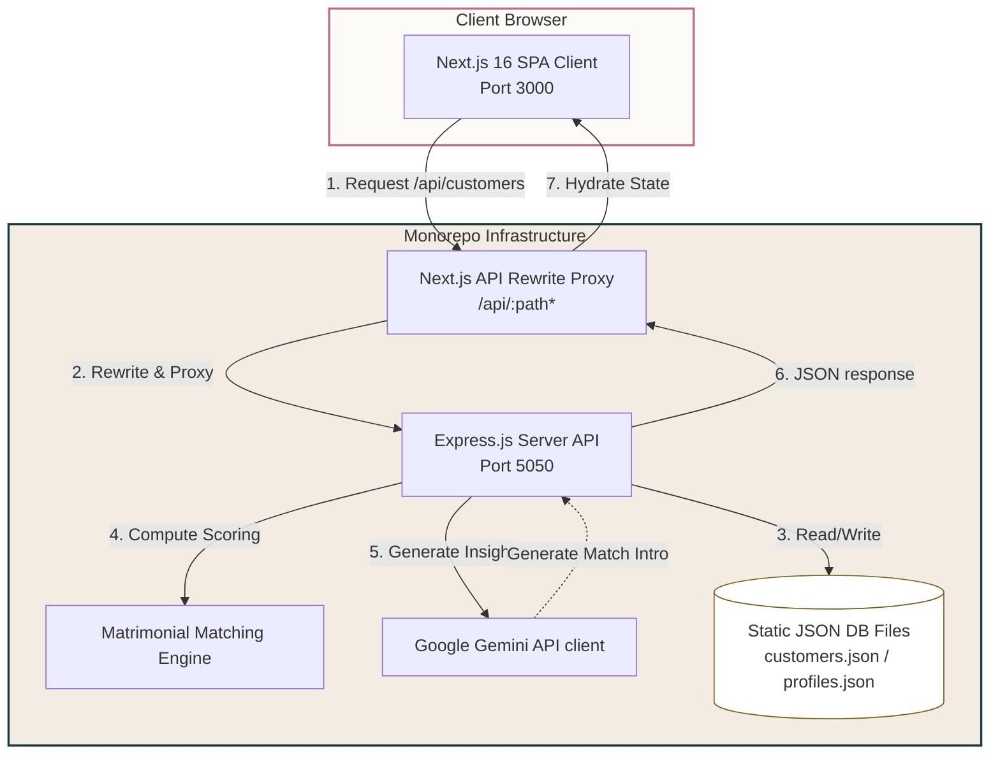
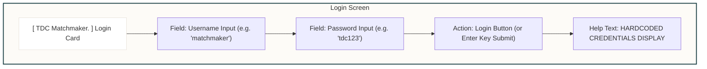
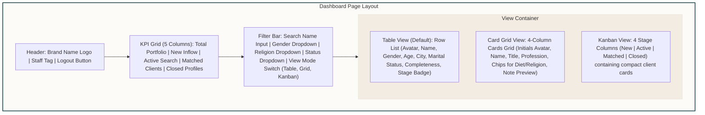
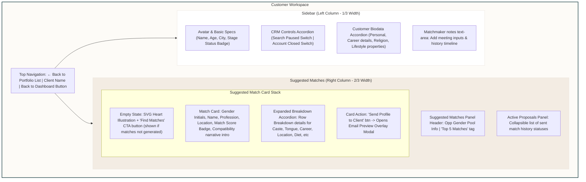

# 💖 TDC Matchmaker CRM Monorepo

[](https://nextjs.org/)
[](https://expressjs.com/)
[](https://deepmind.google/technologies/gemini/)
[](https://github.com/)

An internal matchmaking workspace and customer book manager designed for **The Dating Club (TDC)** matchmaking team. This application enables matchmakers to manage client portfolios, track journey stages, run the matrimonial matching engine, and generate personalized Gemini AI match insights.

---

## 🚀 Quick Start & Installation

### Step 1: Install Dependencies
Install dependencies at the monorepo root and inside both the frontend/backend modules:
```bash
npm install
npm run install:all
```

### Step 2: Configure Gemini API Key
Create a `.env.local` file in the root directory to store your API credentials:
```env
GEMINI_API_KEY="your-google-gemini-api-key"
```

> [!TIP]
> **No API Key? No Problem!**
> If `GEMINI_API_KEY` is not present, the system automatically falls back to a **smart local heuristic generator** that outputs realistic, multi-sentence partner compatibility narratives based on matching vectors.

### Step 3: Run the Development Server
Launch both development servers concurrently:
```bash
# Start backend API (Port 5050) & frontend client (Port 3000)
npm run dev:backend
# In a separate shell session
npm run dev:frontend
```
Open [http://localhost:3000](http://localhost:3000) in your browser.

---

## 🔑 Hardcoded Credentials

Access the dashboard using the following credentials:
* **Username:** `matchmaker`
* **Password:** `tdc123`

---

## 🛠️ Monorepo Scripts Directory

All workspace tasks can be orchestrated directly from the root folder:

| Command | Action / Scope | Target Location |
| :--- | :--- | :--- |
| `npm run install:all` | Installs dependencies for frontend & backend | `frontend/` & `backend/` |
| `npm run dev:backend` | Starts the Express.js API server (Port 5050) | `backend/server.js` |
| `npm run dev:frontend` | Starts the Next.js development client (Port 3000) | `frontend/` |
| `npm run build:frontend` | Compiles Next.js for production deployment | `frontend/.next/` |

---

## 📂 Project Structure

```text
Matchmaker Dashboard/
├── frontend/                 # Client SPA (Next.js 16 App Router)
│   ├── app/                  # UI Views & layouts (login, dashboard, customer details)
│   ├── components/           # Reusable widgets (cards, list tables, accordions)
│   ├── hooks/                # Client state hooks (useCustomers, useMatches, useNotes)
│   ├── styles/               # Design token stylesheets (globals.css)
│   └── next.config.mjs       # Rewrites API routing proxy to Port 5050
│
├── backend/                  # API Web Server (Node.js/Express.js ES Modules)
│   ├── config/               # Database seed loaders
│   ├── controllers/          # Endpoint controllers (auth, customers, matches, notes)
│   ├── lib/                  
│   │   ├── matching/         # Core compatibility matching algorithm formulas
│   │   └── ai/               # Gemini API SDK integration wrapper
│   ├── routes/               # Express endpoints routers mapping
│   ├── services/             # Low-level JSON database read/write service
│   └── server.js             # Express app bootloader & dotenv loaders
│
├── database/                 # Structured schemas & data files
│   ├── schemas/              # Mongoose data modeling documentation
│   └── seed/                 # Datastores files (customers.json, profiles.json)
```

---

## 📐 System Architecture

The monorepo separates view presentation from business computations and algorithms:



---

## 🎨 User Interface Wireframes

### 1. Login Page Layout


### 2. Portfolio Dashboard Page Layout


### 3. Customer Detail Page & Matchmaking Workspace


---

## 📝 Algorithmic Compatibility Engine

Matrimonial compatibility score calculations reside in [matchmaker.js](file:///Users/anjaliprajapati/Desktop/Matchmaker%20Dashboard/backend/lib/matching/matchmaker.js) and rank candidates based on 9 core Indian matrimonial vectors:

| Scoring Category | Method / Logic | Matrimonial Rationale |
| :--- | :--- | :--- |
| **1. Religion & Caste** | Matches religion. Awards full points for matching caste. Handles inter-faith exceptions. | Culturally aligned social backgrounds. |
| **2. Mother Tongue** | Identifies exact matches in spoken languages. | Communication comfort & family integration. |
| **3. Location** | Scores local matches highest. Relocatability flags award partial credit. | Eliminates geographical friction. |
| **4. Family Values** | Calculates difference on traditional $\leftrightarrow$ liberal spectrum. | Alignment of core lifestyles. |
| **5. Career & Income** | Matches salary packages relative to client income preferences. | Aligned socio-economic standing. |
| **6. Diet** | Matches food preference tiers (Jain > Veg > Eggetarian > Non-Veg). | Kitchen coordination. |
| **7. Education Level** | Evaluates equivalence in professional degrees. | Intellectual compatibility. |
| **8. Horoscope** | Evaluates manglik status and matching preferences. | Astro-compatibility preferences. |
| **9. Age** | Calculates difference tolerances. | Age gap preferences. |
